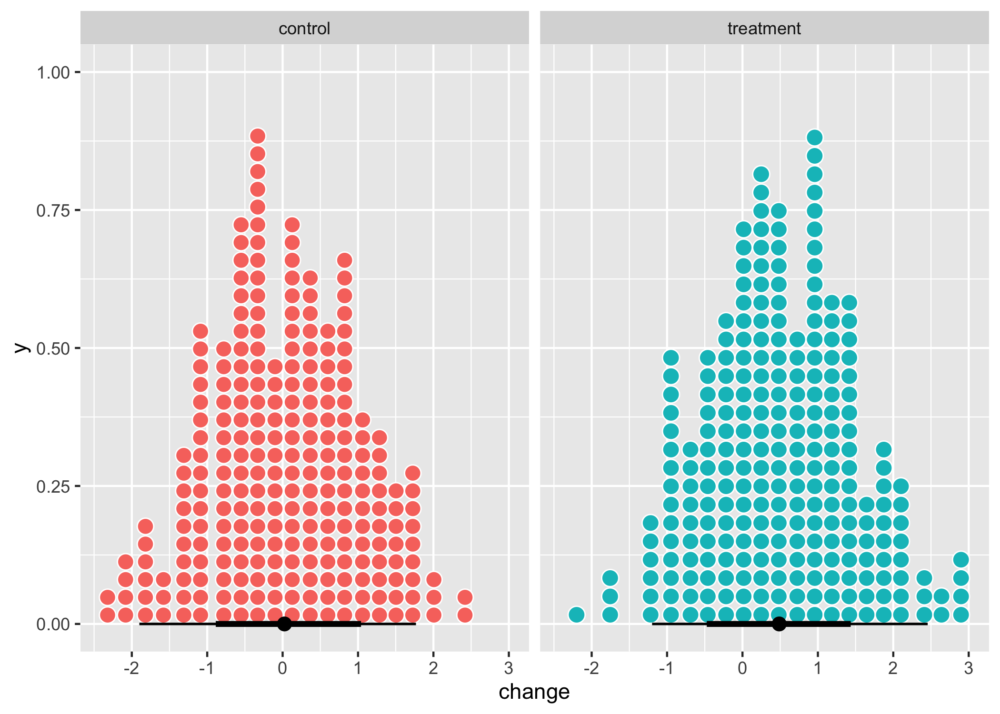
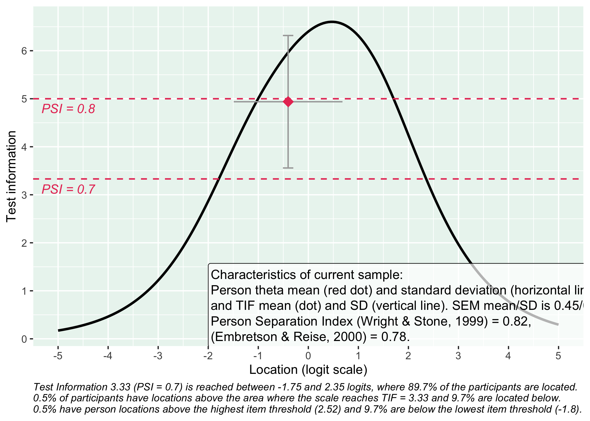
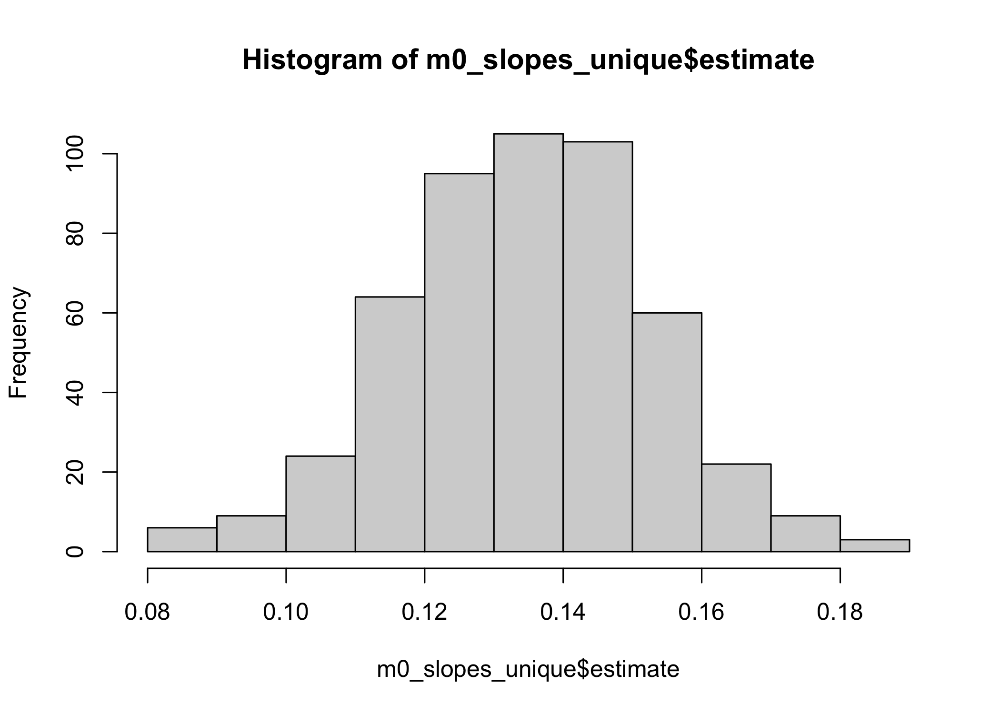

## Introduction

When one uses Rasch or Item Response Theory to estimate measurement values on the latent scale it is also easy to estimate an "individualized" measurement error for each value estimated. It has been suggested that a useful way to use this output when analyzing data with two repeated measurement points is to conduct one paired t-test for each individual, comparing the pre/post measurements and using their respective measurement error as the "population standard error" [@hobart_effect_2010].

This strategy results in measurably detectable change for individuals across two time points. Whether this change is meaningful requires  external validation to determine. Since measurement error is not equal across the continuum, how large the measurably detactable change is will also vary depending on the pre-measurement value.

All the usual limitations and caveats with t-tests apply. This post is not an endorsement of using multiple t-tests as a primary strategy of analysis, but it may be an interesting perspective that takes measurement error into account and focuses on individual outcomes.

::: {.callout-note}
This is work in progress and will be updated and expanded on. The first aim is to share code to do individual t-tests of theta+SEM and summarise the results. Later on, we'll look at other methods to analyze longitudinal data, both looking at group level and individual level change.
:::

The reliability of the scale/test will of course heavily influence the possibility of detecting change over time. In the Rasch Measurement Theory and Item Response Theory paradigm, reliability is not a single point value that is constant across the latent continuum (REF to separate post on reliability). Depending on the item threshold locations, the test has varying reliability. 

Later in this post, I will present a figure describing the Test Information Function, and then a figure with the SEM values across the latent continuum.

As shown in the separate post on reliability (LINK), SEM * 1.96 will contain the true value in  95% of cases.

::: {.cell}

```{.r .cell-code}
library(tidyverse)
library(eRm)
library(janitor)
library(RISEkbmRasch)
library(lme4)
library(modelsummary)
library(broom.mixed)
library(marginaleffects)
library(faux)
library(ggdist)

### some commands exist in multiple packages, here we define preferred ones that are frequently used
select <- dplyr::select
count <- dplyr::count
recode <- car::recode
rename <- dplyr::rename

theme_rise <- function(fontfamily = "Lato", axissize = 13, titlesize = 15,
                       margins = 12, axisface = "plain", panelDist = 0.6, ...) {
  theme_minimal() +
  theme(
    text = element_text(family = fontfamily),
    axis.title.x = element_text(
      margin = margin(t = margins),
      size = axissize
    ),
    axis.title.y = element_text(
      margin = margin(r = margins),
      size = axissize
    ),
    plot.title = element_text(
      face = "bold",
      size = titlesize
    ),
    axis.title = element_text(
      face = axisface
    ),
    plot.caption = element_text(
      face = "italic"
    ),
    legend.text = element_text(family = fontfamily),
    legend.background = element_rect(color = "lightgrey"),
    strip.background = element_rect(color = "lightgrey"),
    panel.spacing = unit(panelDist, "cm", data = NULL),
    panel.border = element_rect(color = "grey", fill = NA),
    ...
  )
}

theme_set(theme_rise())
```
:::

## Simulating longitudinal data

3 time points for later use. First, we'll focus on t1 and t3 and run the t-tests focusing on individual change.

::: {.cell}

```{.r .cell-code}
set.seed(1523)

data_g1 <- rnorm_multi(n = 250, 
                  mu = c(-0.25, 0, 0.25),
                  sd = c(1, 1, 1),
                  r = c(0.5), 
                  varnames = c("t_1", "t_2", "t_3"),
                  empirical = FALSE) %>% 
  add_column(group = "treatment") %>% 
  rownames_to_column("id")

data_g2 <- rnorm_multi(n = 250, 
                  mu = c(-0.25, -0.15, -0.05),
                  sd = c(1, 1, 1),
                  r = c(0.5), 
                  varnames = c("t_1", "t_2", "t_3"),
                  empirical = FALSE) %>% 
  add_column(group = "control") %>% 
  mutate(id = c(251:500))

d <- rbind(data_g1,data_g2)

d_long <- d %>% 
  pivot_longer(starts_with("t")) %>% 
  mutate(time = as.numeric(gsub("t_","",name))) %>% 
  select(!name)
```
:::

### Simulate response data

::: {.cell}

```{.r .cell-code}
# item list for simulation
tlist <- list(
  t1 = list(1.2, 1.8, 2.4),
  t2 = list(-1.3, -0.5, 0.5),
  t3 = list(-0.3, 0.3, 1.2),
  t4 = list(0.1, 0.6, 1.6),
  t5 = list(-0.3, 0.7, 1.5),
  t6 = list(-1.6, -1, -0.3),
  t7 = list(1, 1.8, 2.5),
  t8 = list(-1.3, -0.7, 0.4),
  t9 = list(-0.8, 1.4, 1.9),
  t10 = list(0.25, 1.25, 2.15)
)

inputDeltas <- tibble(
  q1 = c(1.2, 1.8, 2.4),
  q2 = c(-1.3, -0.5, 0.5),
  q3 = c(-0.3, 0.3, 1.2),
  q4 = c(0.1, 0.6, 1.6),
  q5 = c(-0.3, 0.7, 1.5),
  q6 = c(-1.6, -1, -0.3),
  q7 = c(1, 1.8, 2.5),
  q8 = c(-1.3, -0.7, 0.4),
  q9 = c(-0.8, 1.4, 1.9),
  q10 = c(0.25, 1.25, 2.15)
) %>%
  t() %>%
  as.data.frame() %>%
  mutate(Average = rowMeans(., na.rm = T)) %>% 
  mutate_if(is.double, round, digits = 2) %>% 
  rownames_to_column(var = "Item") %>% 
  dplyr::rename(T1 = V1,
         T2 = V2,
         T3 = V3)

# simulate response data based on the above defined item thresholds
td <- SimPartialScore(
  deltaslist = tlist,
  thetavec = d_long$value
) %>%
  as.data.frame()
```
:::

### Estimating item threshold locations

We could use the parameters from the input, but to add some real world usage to the setup, we'll stack the response data and estimate the item threshold locations using the `eRm` package with the Partial Credit Model and Conditional Maximum Likelihood.

::: {.cell}

```{.r .cell-code}
erm_item_parameters <- RIitemparams(td, output = "dataframe") %>% 
  select(!Location) %>% 
  rename(T1 = `Threshold 1`,
         T2 = `Threshold 2`,
         T3 = `Threshold 3`) %>% 
  as.matrix()

# center item parameters to sum = 0
erm_item_parameters <- erm_item_parameters - mean(erm_item_parameters)
```
:::

### Estimating person locations and SEM

Using Weighted Likelihood (Warm, 1989) to minimize bias.

::: {.cell}

```{.r .cell-code}
# estimate thetas/person locations, based on eRm estimated item thresholds
erm_thetas <- RIestThetasOLD(td, itemParams = erm_item_parameters)

# estimate measurement error (SEM)
erm_sem <- map_vec(erm_thetas, ~ catR::semTheta(.x, it = erm_item_parameters, method = "WL", model = "PCM"))

d_long$erm_thetas <- erm_thetas
d_long$erm_sem <- erm_sem
```
:::

## Change

How many have changed 0.5+ logits (the mean change simulated, also corresponding to 0.5 SD) in the generated data? This could serve as a reference.

ADD: identify which ID's have changed to make a comparison later on.

::: {.cell}

```{.r .cell-code}
d <- d %>% 
  mutate(change = t_3 - t_1)

summary(d$change)
```

::: {.cell-output .cell-output-stdout}

```
   Min. 1st Qu.  Median    Mean 3rd Qu.    Max. 
-2.4126 -0.4427  0.2565  0.2682  0.9909  3.0004 
```


:::

```{.r .cell-code}
sd(d$change)
```

::: {.cell-output .cell-output-stdout}

```
[1] 1.00556
```


:::

```{.r .cell-code}
sd(d$t_3)
```

::: {.cell-output .cell-output-stdout}

```
[1] 1.02455
```


:::

```{.r .cell-code}
ggplot(d, aes(x = change, fill = group, color = group)) +
  #geom_histogram() +
  stat_dotsinterval(color = "black", slab_color = "white", slab_linewidth = 0.5) +
  facet_wrap(~ group) +
  guides(fill = "none", color = "none")
```

::: {.cell-output-display}
{width=1050}
:::

```{.r .cell-code}
d %>% 
  mutate(change_grp = case_when(change > 0.5 ~ "Improved > 0.5",
                                change < -0.5 ~ "Worsened > 0.5",
                                TRUE ~ "In between")) %>% 
  group_by(group) %>% 
  count(change_grp) %>% 
  kbl_rise(tbl_width = 40) %>% 
  row_spec(c(1,4),bold=TRUE)
```

::: {.cell-output-display}
`````{=html}
<table data-quarto-disable-processing="true" style="width:40%; font-size: 14px;  font-family: Arial; margin-left: auto; margin-right: auto;" class="table table-striped table-hover lightable-classic">
 <thead>
  <tr>
   <th style="text-align:left;position: sticky; top:0; background-color: #FFFFFF;font-weight: bold;"> group </th>
   <th style="text-align:left;position: sticky; top:0; background-color: #FFFFFF;font-weight: bold;"> change_grp </th>
   <th style="text-align:right;position: sticky; top:0; background-color: #FFFFFF;font-weight: bold;"> n </th>
  </tr>
 </thead>
<tbody>
  <tr>
   <td style="text-align:left;font-weight: bold;"> control </td>
   <td style="text-align:left;font-weight: bold;"> Improved &gt; 0.5 </td>
   <td style="text-align:right;font-weight: bold;"> 82 </td>
  </tr>
  <tr>
   <td style="text-align:left;"> control </td>
   <td style="text-align:left;"> In between </td>
   <td style="text-align:right;"> 95 </td>
  </tr>
  <tr>
   <td style="text-align:left;"> control </td>
   <td style="text-align:left;"> Worsened &gt; 0.5 </td>
   <td style="text-align:right;"> 73 </td>
  </tr>
  <tr>
   <td style="text-align:left;font-weight: bold;"> treatment </td>
   <td style="text-align:left;font-weight: bold;"> Improved &gt; 0.5 </td>
   <td style="text-align:right;font-weight: bold;"> 124 </td>
  </tr>
  <tr>
   <td style="text-align:left;"> treatment </td>
   <td style="text-align:left;"> In between </td>
   <td style="text-align:right;"> 85 </td>
  </tr>
  <tr>
   <td style="text-align:left;"> treatment </td>
   <td style="text-align:left;"> Worsened &gt; 0.5 </td>
   <td style="text-align:right;"> 41 </td>
  </tr>
</tbody>
</table>

`````
:::
:::

### Test information function

::: {.cell}

```{.r .cell-code}
RItif(td, samplePSI = TRUE)
```

::: {.cell-output-display}
{width=1050}
:::
:::


## t-tests of individual change

Only using t1 and t3 estimated person locations/thetas and SEM values.

::: {.cell}

```{.r .cell-code}
d_wide_tt <- d_long %>% 
  pivot_wider(values_from = c(erm_thetas,erm_sem),
              id_cols = c(id,group),
              names_from = time
              ) %>% 
  mutate(id = as.numeric(id))

# basic formula for t-test
# (d_wide_tt$erm_thetas_1[1] - d_wide_tt$erm_thetas_3[1]) / sqrt(d_wide_tt$erm_sem_1[1] + d_wide_tt$erm_sem_3[1])

# t-tests for all rows in dataframe
t_values <- c()
for (i in 1:nrow(d_wide_tt)) {
 t_values[i] <- (d_wide_tt$erm_thetas_3[i] - d_wide_tt$erm_thetas_1[i]) / sqrt(d_wide_tt$erm_sem_3[i] + d_wide_tt$erm_sem_1[i])
}

tt_results <- data.frame(t_values = t_values,
           group = rep(c("Intervention","Control"), each = 250)) %>% 
  mutate(result95 = case_when(t_values > 1.96 ~ "Improved",
                            t_values < -1.96 ~ "Worsened",
                            TRUE ~ "No detectable change")) %>% 
  mutate(result84 = case_when(t_values > 1.405 ~ "Improved",
                            t_values < -1.405 ~ "Worsened",
                            TRUE ~ "No detectable change"))

tt_results %>% 
  group_by(group) %>%
  count(result95) %>%
  kbl_rise(tbl_width = 40) %>%
  row_spec(c(1,4),bold=TRUE)
```

::: {.cell-output-display}
`````{=html}
<table data-quarto-disable-processing="true" style="width:40%; font-size: 14px;  font-family: Arial; margin-left: auto; margin-right: auto;" class="table table-striped table-hover lightable-classic">
 <thead>
  <tr>
   <th style="text-align:left;position: sticky; top:0; background-color: #FFFFFF;font-weight: bold;"> group </th>
   <th style="text-align:left;position: sticky; top:0; background-color: #FFFFFF;font-weight: bold;"> result95 </th>
   <th style="text-align:right;position: sticky; top:0; background-color: #FFFFFF;font-weight: bold;"> n </th>
  </tr>
 </thead>
<tbody>
  <tr>
   <td style="text-align:left;font-weight: bold;"> Control </td>
   <td style="text-align:left;font-weight: bold;"> Improved </td>
   <td style="text-align:right;font-weight: bold;"> 13 </td>
  </tr>
  <tr>
   <td style="text-align:left;"> Control </td>
   <td style="text-align:left;"> No detectable change </td>
   <td style="text-align:right;"> 228 </td>
  </tr>
  <tr>
   <td style="text-align:left;"> Control </td>
   <td style="text-align:left;"> Worsened </td>
   <td style="text-align:right;"> 9 </td>
  </tr>
  <tr>
   <td style="text-align:left;font-weight: bold;"> Intervention </td>
   <td style="text-align:left;font-weight: bold;"> Improved </td>
   <td style="text-align:right;font-weight: bold;"> 27 </td>
  </tr>
  <tr>
   <td style="text-align:left;"> Intervention </td>
   <td style="text-align:left;"> No detectable change </td>
   <td style="text-align:right;"> 219 </td>
  </tr>
  <tr>
   <td style="text-align:left;"> Intervention </td>
   <td style="text-align:left;"> Worsened </td>
   <td style="text-align:right;"> 4 </td>
  </tr>
</tbody>
</table>

`````
:::

```{.r .cell-code}
# as estimated using 84% CI
tt_results %>% 
  group_by(group) %>%
  count(result84) %>%
  kbl_rise(tbl_width = 40) %>%
  row_spec(c(1,4),bold=TRUE)
```

::: {.cell-output-display}
`````{=html}
<table data-quarto-disable-processing="true" style="width:40%; font-size: 14px;  font-family: Arial; margin-left: auto; margin-right: auto;" class="table table-striped table-hover lightable-classic">
 <thead>
  <tr>
   <th style="text-align:left;position: sticky; top:0; background-color: #FFFFFF;font-weight: bold;"> group </th>
   <th style="text-align:left;position: sticky; top:0; background-color: #FFFFFF;font-weight: bold;"> result84 </th>
   <th style="text-align:right;position: sticky; top:0; background-color: #FFFFFF;font-weight: bold;"> n </th>
  </tr>
 </thead>
<tbody>
  <tr>
   <td style="text-align:left;font-weight: bold;"> Control </td>
   <td style="text-align:left;font-weight: bold;"> Improved </td>
   <td style="text-align:right;font-weight: bold;"> 32 </td>
  </tr>
  <tr>
   <td style="text-align:left;"> Control </td>
   <td style="text-align:left;"> No detectable change </td>
   <td style="text-align:right;"> 182 </td>
  </tr>
  <tr>
   <td style="text-align:left;"> Control </td>
   <td style="text-align:left;"> Worsened </td>
   <td style="text-align:right;"> 36 </td>
  </tr>
  <tr>
   <td style="text-align:left;font-weight: bold;"> Intervention </td>
   <td style="text-align:left;font-weight: bold;"> Improved </td>
   <td style="text-align:right;font-weight: bold;"> 62 </td>
  </tr>
  <tr>
   <td style="text-align:left;"> Intervention </td>
   <td style="text-align:left;"> No detectable change </td>
   <td style="text-align:right;"> 179 </td>
  </tr>
  <tr>
   <td style="text-align:left;"> Intervention </td>
   <td style="text-align:left;"> Worsened </td>
   <td style="text-align:right;"> 9 </td>
  </tr>
</tbody>
</table>

`````
:::

```{.r .cell-code}
# actual change
d %>% 
  mutate(change_grp = case_when(change > 0.5 ~ "Improved > 0.5",
                                change < -0.5 ~ "Worsened > 0.5",
                                TRUE ~ "In between")) %>% 
  group_by(group) %>% 
  count(change_grp) %>% 
  kbl_rise(tbl_width = 40) %>% 
  row_spec(c(1,4),bold=TRUE)
```

::: {.cell-output-display}
`````{=html}
<table data-quarto-disable-processing="true" style="width:40%; font-size: 14px;  font-family: Arial; margin-left: auto; margin-right: auto;" class="table table-striped table-hover lightable-classic">
 <thead>
  <tr>
   <th style="text-align:left;position: sticky; top:0; background-color: #FFFFFF;font-weight: bold;"> group </th>
   <th style="text-align:left;position: sticky; top:0; background-color: #FFFFFF;font-weight: bold;"> change_grp </th>
   <th style="text-align:right;position: sticky; top:0; background-color: #FFFFFF;font-weight: bold;"> n </th>
  </tr>
 </thead>
<tbody>
  <tr>
   <td style="text-align:left;font-weight: bold;"> control </td>
   <td style="text-align:left;font-weight: bold;"> Improved &gt; 0.5 </td>
   <td style="text-align:right;font-weight: bold;"> 82 </td>
  </tr>
  <tr>
   <td style="text-align:left;"> control </td>
   <td style="text-align:left;"> In between </td>
   <td style="text-align:right;"> 95 </td>
  </tr>
  <tr>
   <td style="text-align:left;"> control </td>
   <td style="text-align:left;"> Worsened &gt; 0.5 </td>
   <td style="text-align:right;"> 73 </td>
  </tr>
  <tr>
   <td style="text-align:left;font-weight: bold;"> treatment </td>
   <td style="text-align:left;font-weight: bold;"> Improved &gt; 0.5 </td>
   <td style="text-align:right;font-weight: bold;"> 124 </td>
  </tr>
  <tr>
   <td style="text-align:left;"> treatment </td>
   <td style="text-align:left;"> In between </td>
   <td style="text-align:right;"> 85 </td>
  </tr>
  <tr>
   <td style="text-align:left;"> treatment </td>
   <td style="text-align:left;"> Worsened &gt; 0.5 </td>
   <td style="text-align:right;"> 41 </td>
  </tr>
</tbody>
</table>

`````
:::

```{.r .cell-code}
# ratio of control/intervention improvement
#82/124
#32/62
```
:::

### Linear mixed model

::: {.cell}

```{.r .cell-code}
library(lme4)
library(marginaleffects)

m0 <- lmer(erm_thetas ~ time + (1 + time | id),
          data = d_long,
          REML = TRUE)
m0_slopes <- slopes(m0)

m0_slopes_unique <- m0_slopes %>% 
  group_by(id) %>% 
  summarise(estimate = mean(estimate),
            conf.low = mean(conf.low),
            conf.high = mean(conf.high),
            p.value = mean(p.value)
            ) %>% 
  ungroup()

hist(m0_slopes_unique$estimate)
```

::: {.cell-output-display}
{width=1050}
:::

```{.r .cell-code}
PIDs <- d_long %>% 
  filter(time == 1) %>% 
  pull(id)

tt_slopes_comp <- tt_results %>% 
  add_column(id = PIDs) %>% 
  left_join(m0_slopes_unique, by = "id")

tt_slopes_comp %>%
  mutate(sign.change = ifelse(p.value < 0.05, "sig change","no change")) %>% 
  mutate(posneg = ifelse(estimate > 0, "pos change","neg change")) %>% 
  count(sign.change,posneg)
```

::: {.cell-output .cell-output-stdout}

```
  sign.change     posneg   n
1  sig change pos change 500
```


:::
:::


### "Recovery" of n changed

Again, strongly affected by precision/reliability

ADD: compare % correctly identified in each of the three groups.
ALSO: use 84% CI instead (1.405 instead of 1.96) to see how that affects detection rate.


